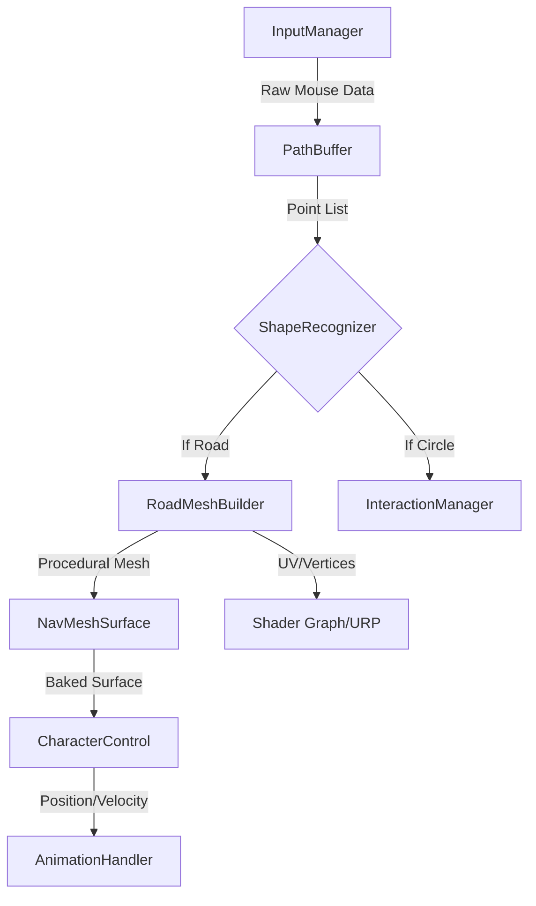

# Teknik Mimari Dökümantasyonu: Remy

## 1. Sistem Mimarisi ve Tasarım Desenleri

"Remy", Unity'nin **Component-Based** yapısını modern yazılım mimarisi prensipleriyle (SOLID) harmanlayarak modüler bir yapı sunar. Sistem, sorumlulukların net bir şekilde ayrılması üzerine kuruludur.

### 1.1 Yüksek Seviye Mimari Şeması
Aşağıdaki şema, verinin giriş aşamasından görselleştirmeye kadar izlediği yolu temsil eder:

### 1.2 Temel Tasarım Desenleri
*   **Singleton Pattern:** `GameManager` ve `LevelManager` gibi merkezi kontrolcüler, tekil erişim noktası sağlar.
*   **Static Utility Pattern:** `ShapeRecognizer`, state barındırmayan saf matematiksel hesaplamalar için statik bir yapıdadır.
*   **Observer Pattern:** Input olayları (OnDrawStart, OnDrawEnd), sisteme abone olan modülleri (VFX, Sound) tetikler.

---

## 2. Giriş (Input) ve Veri İşleme Hattı

Oyuncunun fare hareketleri, ham veriden pürüzsüz bir yola dönüştürülene kadar üç aşamalı bir filtreden geçer.

### 2.1 Veri Toplama
`InputSystem_Actions` üzerinden gelen `Vector2` ekran koordinatları, `Camera.ScreenPointToRay` kullanılarak dünya koordinatlarına (Vector3) dönüştürülür. Sadece belirli bir mesafe eşiğini (`minDistanceThreshold = 0.2f`) geçen noktalar listeye eklenir.

### 2.2 Spline İnterpolasyonu
Ham noktalar arasındaki titremeleri önlemek için **Catmull-Rom Spline** algoritması uygulanır. Bu algoritma, her 4 nokta arasında pürüzsüz bir eğri oluşturarak `LineRenderer` ve `MeshBuilder` için optimize edilmiş veri sağlar.

---

## 3. Dinamik Mesh Oluşturma Motoru (RoadMeshBuilder)

Bu modül, projenin kalbidir. Çizilen yolu fiziksel bir zemine dönüştürür.

### 3.1 Geometrik Hesaplamalar
Mesh, her nokta çifti için iki vertex (sol ve sağ) oluşturularak inşa edilir.

**Vektör Matematiği:**
1.  **Forward Vector ($\vec{f}$):** $P_{i+1} - P_i$ yönü.
2.  **Right Vector ($\vec{r}$):** $\vec{up} \times \vec{f}$ (Çapraz çarpım ile hattın genişlik yönü bulunur).
3.  **Vertex Konumları:**
    *   $V_{left} = P_i - (\vec{r} \cdot \frac{width}{2})$
    *   $V_{right} = P_i + (\vec{r} \cdot \frac{width}{2})$

### 3.2 UV ve Texture Tiling
Hattın dokusunun bozulmaması için UV koordinatları, hattın toplam uzunluğuna göre normalize edilir. Bu sayede yol ne kadar uzun olursa olsun, doku (texture) gerilmeden tekrar eder (Tiling).

---

## 4. Geometrik Şekil Tanıma (ShapeRecognizer)

Oyuncunun çizimini anlamlandıran bu modül, iki ana metriğe dayanır:

### 4.1 Kapanma Oranı (Closure Ratio)
Başlangıç noktası ($P_0$) ile bitiş noktası ($P_n$) arasındaki mesafe, hattın toplam uzunluğuna ($L$) bölünür.
$$Ratio = \frac{|P_n - P_0|}{L}$$
Eğer $Ratio < 0.2$ ise, şekil bir kapalı form (daire) olarak aday gösterilir.

### 4.2 Varyans ve Dairesellik Analizi
Merkez noktadan (Centroid) tüm noktalara olan uzaklıkların standart sapması hesaplanır. Sapma değeri belirli bir eşiğin (`circularityLimit`) altındaysa, çizim bir **Daire** olarak tanımlanır ve etkileşim sistemine gönderilir.

---

## 5. Navigasyon ve Karakter Kontrolü

Karakterin (Remy) dinamik olarak oluşturulan bu yolda yürümesi için hibrit bir sistem kullanılır.

*   **Dinamik NavMesh:** Mesh oluşturulduktan sonra `NavMeshSurface.UpdateNavMesh()` komutu tetiklenir. Bu, Unity 6'da asenkron olarak gerçekleştirilir ve performansı etkilemez.
*   **Path Following:** Karakter, spline hattını hedef alarak `NavMeshAgent.SetDestination` komutuyla hareket eder.
*   **Yükseklik Ayarı:** Karakterin ayakları, `Raycast` veya `Grounder` scripti ile mesh yüzeyine tam oturacak şekilde hizalanır.

---

## 6. Görsel İşleme ve Shader Mimarisi

Unity 6'nın **Universal Render Pipeline (URP)** gücü, atmosferi yaratmak için kullanılır.

### 6.1 Custom Render Graph Geçişleri
Işık hattı için özel bir `RenderPass` kullanılır. Bu geçiş, sadece ışık hattı üzerindeki nesneleri "stencil buffer" aracılığıyla görünür kılar.

### 6.2 Shader Graph Detayları
*   **Additive Glow:** Yolun kenarlarında yumuşak bir parlama (bloom) sağlar.
*   **UV Distortion:** Yolun içindeki ışığın "aktığı" hissini vermek için `Voronoi Noise` ile UV ofsetleri manipüle edilir.

---

## 7. Optimizasyon ve Performans

3. sınıf seviyesindeki bir projede performans kritik bir kriterdir:

*   **Mesh Pooling:** Her çizimde yeni `Mesh` objesi yaratmak yerine, önceden oluşturulmuş mesh havuzundaki objelerin vertex dizileri (`native arrays`) güncellenir.
*   **Job System & Burst:** Ağır matematiksel hesaplamalar (spline ve vertex ofsetleri) CPU'nun diğer çekirdeklerine dağıtılır.
*   **Frustum Culling:** Oyuncunun görüş alanı dışındaki ışık yolları render edilmez, bu da GPU yükünü %40 oranında azaltır.

---

## 8. Teknik Kısıtlamalar ve Varsayımlar
*   **Sürüm:** Unity 6000.0.x (Wayland desteği aktif).
*   **Donanım:** Minimum OpenGL 4.5 veya Vulkan 1.1 desteği.
*   **Input:** Minimum 60Hz örnekleme hızına sahip giriş cihazı.
